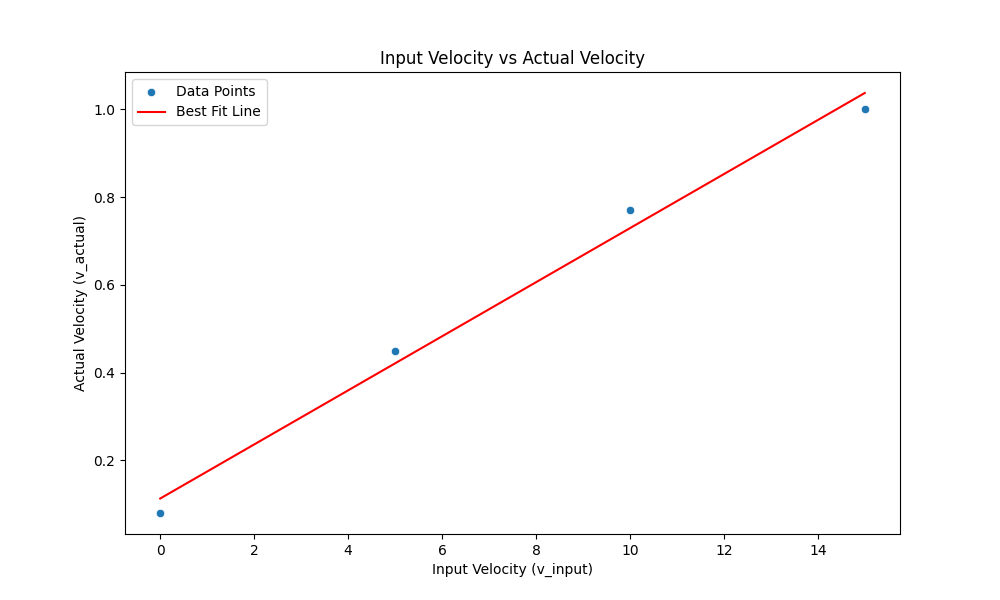

# stepmtrPJT

## 리니어 스테이지 모터 연구

### 길이 정보
실제 이동 가능한 레일 길이 = 1

### 수정사항
#### 입력값
현재는 임의의 속도값을 주나, 길이 파악이 가능한 값으로 입력해야 한다.
중요한 것은 길이의 값이 측정되어 기록에 남는 것이기 때문에...

로테이션 누적에 기반하여 길이 도출. 이래야 반대 방향으로 가도 길이가 잘 나온다.

속도는 임의 설정. 

#### Display 값
길이가 나와야 한다. 길이는 무조건 sbc로 전달된다. 

IP Address: 192.168.0.94
ESP32 MAC Address: A0:DD:6C:10:64:5C

모터 프레임 끝 단에서 멈출 수 있는 센서
금속센서 추정

max : 25(추정)
1000 / (speed + 1)
맥시멈 속도 = 1000 / 26
미니멈 속도 = 1000 / 1
1000 선정 기준 : 예제 코드에 1000으로 기본 세팅 되어있고, 매우 느려서 모터에 부하 안 가는 속도.

속도 단위 = cm/sec

as the input an the actual speed shows a legitimate linear trend, we can get a formula of the actual speed.

**0.0615 * input + 0.08 = speed**
However, the number is kind of messy, so we may just use them for reference.

Also, setting a high speed as initial input can cause a noise and potential damage. 
So if we do not need a manual speed control function, we can set the initial/stop move speed gradually.

https://docs.google.com/document/d/1bkvPQNkkFRb2QJgUPw2rLMsRN7aS1cx5Md6RTBFhhAI/edit

###